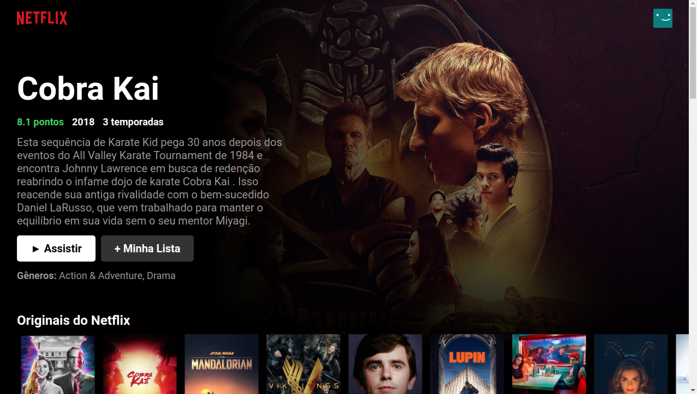

<p align="center">
   
</p>

<div align="center">
  <sub>
    Netflix web application frontend clone<br/>
    Created based on the video from <b>Bonieky Lacerda</b><br/>
    Made by <a href="https://github.com/KaikySantos">Kaiky Santos</a>
  </sub>
</div>

<br/><br/>

# :eyes: View project

Click on the button below to see the project's deployment on [Vercel](https://vercel.com)

[](https://netflixclone-kohl.vercel.app/)

<br/>

# :camera: Screenshot

<div>
   
</div>

<br/><br/>

# :construction_worker: How work ?
```bash
# Clone this repository
$ git clone https://github.com/KaikySantos/Proffy.git
# Access the project folder
$ cd netflixclone
# Install the dependencies
$ npm install
# Run the application
$ npm start
```
Go to http://localhost:3000/ to see the result!
